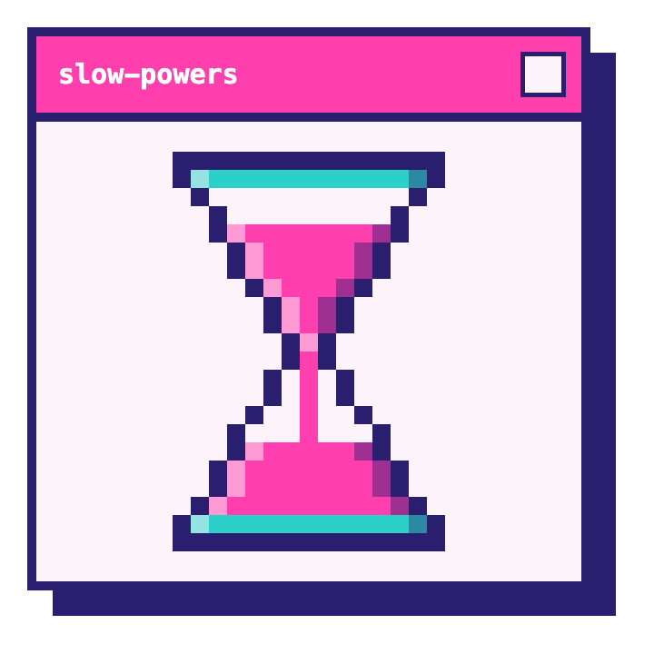

<p align="center">
  
</p>

<p align="center">
  <a href="https://github.com/slowdini/slow-powers/actions/workflows/ci.yml"></a>
  <a href="https://github.com/slowdini/slow-powers/releases/latest"></a>
  <a href="https://www.npmjs.com/package/@slowdini/slow-powers-opencode"></a>
  <a href="./LICENSE"></a>
  <a href="#why-trust-these-skills"></a>
</p>

# Slow-powers

Slow-powers is an agent skill set for professional software development. It enhances plan mode and debugging work, enforces best practices, and works _with_ the features of modern agents, instead of replacing them. It's the plugin for people who don't install plugins.

<p align="center">
  
</p>

<p align="center">
  <sub>The <code>test-driven-development</code> skill catching a race before it ships. Terminal themed with <a href="https://github.com/samiamorwas/synthpunk">Synthpunk Neon Dark</a>.</sub>
</p>

## About this fork

Slow-powers is a fork of [obra/superpowers](https://github.com/obra/superpowers). Much of the skill content is sourced from upstream, with rewrites focusing on clarity, token efficiency, and providing a generally lighter touch.

## Quickstart

[Claude Code](#claude-code) · [Codex CLI](#codex-cli) · [OpenCode](#opencode)

## How it works

Slow-powers is designed to improve the actual day-to-day work of software developers using agents for anything from focused debugging to generating entire features. It instructs agents to check for skills first, and use the ones that apply. The shipped skills fill real gaps in agentic development, but all discoverable skills benefit from the skill-enforcing guidance. Combined with the provided skill-writing and testing guidance, this allows you to extend your workflow with your own verified-to-be-useful skills.

### Start in plan mode

Even small features are developed better with a plan. Slow-powers hardens the plan to catch hallucinations and other mistakes before you review it. During implementation, skills guide the agent through best practices, working in isolation, following test-driven development, and reviewing and verifying its work before it hands it back to you.

### Debugging

Slow-powers guides agents through an evidence-backed, no-guess debugging approach. No "It works now!" without proof. There's also special guidance for specific, tricky-to-debug situations, generated from real-world cases.

### Writing skills

Skills for writing skills! Slow-powers skills are all written and evaluated following the same guidelines and processes it ships. Back up your own skills with real stats, and understand their cost in time and tokens, so you can develop custom workflows when needed.

Skill evaluations are powered by [eval-magic](https://github.com/slowdini/eval-magic)

## Installation

### Install with your agent

Open the harness you want Slow-powers on and paste this prompt:

```text
Install the slow-powers plugin from https://github.com/slowdini/slow-powers#installation for this harness.
```

### Claude Code

```
/plugin marketplace add slowdini/slow-powers
/plugin install slow-powers@slow-powers
```

You can also browse and install it interactively: run `claude`, open
`/plugin`, choose the `slowdini` marketplace, and install `slow-powers`.

### Codex CLI

```bash
codex plugin marketplace add slowdini/slow-powers
codex plugin add slow-powers@slowdini
```

You can also browse and install it interactively: run `codex`, open
`/plugins`, choose the `slowdini` marketplace, and install `slow-powers`.

### OpenCode

```bash
opencode plugin @slowdini/slow-powers-opencode -g
```

## The skills

Slow-powers provides a set of highly focused skills that ensure your agent operates with maximum discipline:

1. **`hardening-plans`** — Instructs the agent to re-review any plans before it hands them back to you, looking for hallucinations, logical inconsistencies, and other common plan mistakes.
2. **`investigating-bugs`** — Guides the agent to locate the root cause of failures via scientific hypothesis testing, avoiding "guess-and-check" thrashing.
3. **`working-in-isolation`** — Establishes an isolated workspace (worktree or branch) so new work doesn't collide with existing or in-progress work, keeping protected branches like `main` clean.
4. **`test-driven-development`** — Enforces a strict RED-GREEN-REFACTOR cycle, ensuring all code is backed by failing test verification first.
5. **`verifying-development-work`** — Requires running actual test/build commands and presenting concrete evidence before any success claim, with a final review pass over the change, code AND comments, before work is handed back.
6. **`writing-skills`** — Helps write and edit skills, following the same best practices that guide slow-powers itself.
7. **`evaluating-skills`** — Teaches the agent how to run skill evals, so the value of skills and prose changes can be objectively assessed.

## Why trust these skills?

Most skill packs ship on vibes. Every slow-powers skill ships with a documented eval — or it doesn't ship (see [Philosophy](#philosophy)). Each skill is measured against an agent with **no skill**, so the number means "this skill made the agent better," not just "we changed something."

| Skill | Improvement vs no skill | n | Model | Last measured |
|---|---|---|---|---|
| `hardening-plans` | TBD | TBD | TBD | TBD |
| `investigating-bugs` | TBD | TBD | TBD | TBD |
| `test-driven-development` | TBD | TBD | TBD | TBD |
| `verifying-development-work` | TBD | TBD | TBD | TBD |

**Improvement vs no skill** is the gain in eval pass-rate (percentage points) when the same [eval-magic](https://github.com/slowdini/eval-magic) suite runs with the skill versus without it.

## Intended Workflows

The skills declare prerequisite / next-step gates so the agent follows an intended skill sequence. These gates **suggest** what comes before and after a skill once it is invoked; they do **not** restrict when any skill can be invoked.

**Plan mode:** plan mode → `hardening-plans` → `working-in-isolation` → `test-driven-development` → `verifying-development-work`

**Debugging:** (`working-in-isolation`) → `investigating-bugs` → `verifying-development-work`

## Philosophy

Slow-powers skills follow a few opinionated principles:

- Test-Driven Development — write tests first, always
- Plan mode — even small features should start with a plan
- Prefer branches to worktrees — branches are easier for human review and testing, worktrees are better for agent isolation
- Skills need evals — evals prove a new skill is better than no skill, and an edit to an existing skill is valuable

## Repository structure

Flat layout — skills and assets live at root, harness-specific integration lives in top-level directories:

- `skills/` — All slow-powers skills
- `assets/` — Icons and images shared across harnesses
- `tests/` — Cross-cutting and harness-specific tests
- `.claude-plugin/` — Claude Code plugin manifest and hooks
- `.codex-plugin/` — OpenAI Codex plugin manifest
- `opencode/` — OpenCode plugin
- `.claude-plugin/marketplace.json` — Claude Code marketplace registry
- `package.json` — OpenCode plugin manifest + dev tooling

## Releasing

Releases are cut from `dev` and tagged from `main`:

1. Merge feature PRs into `dev` after CI passes.
2. When ready to ship, trigger the **Release PR** workflow with the next
   version number. It bumps every manifest via `scripts/bump-version.ts`,
   commits to `dev`, and opens a `dev → main` PR.
3. Review the release PR (full test matrix runs on it) and merge.
4. Merging to `main` automatically tags `vX.Y.Z`, creates the GitHub release,
   and publishes `@slowdini/slow-powers-opencode` to npm.
   Notes come from the release PR body, or auto-generated if empty.

See `.github/workflows/` for the workflow definitions.

## License

MIT — see [`LICENSE`](./LICENSE).
