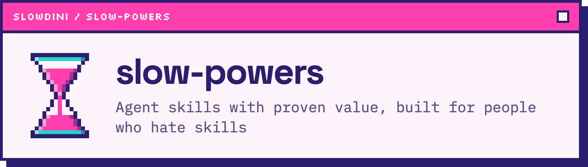

<p align="center">
  
</p>

<p align="center">
  <a href="https://github.com/slowdini/slow-powers/actions/workflows/ci.yml"></a>
  <a href="https://github.com/slowdini/slow-powers/releases/latest"></a>
  <a href="https://www.npmjs.com/package/@slowdini/slow-powers-opencode"></a>
  <a href="./LICENSE"></a>
  <a href="#why-trust-these-skills"></a>
  <a href="https://github.com/agentskills/agentskills/tree/main/skills-ref"></a>
</p>

# Slow-powers

Slow-powers is a focused set of software-development skills for coding agents. It
is for developers who want stronger planning, test-driven development,
root-cause debugging, and final verification without manually steering every
step.

Install it once, then keep talking to your agent normally. Slow-powers works
mostly behind the scenes: it makes the skills available, tells the agent to load
whichever ones fit the task, and prompts the agent to review plans before they
leave plan mode. You can still request a skill by name, but routine work does not
require a separate command vocabulary.

## Installation

Slow-powers supports Claude Code, Codex CLI, OpenCode, and the Cline CLI,
software development kit (SDK), and Kanban.

### Let your agent install it

Open the agent you want to use and paste:

```text
Install the slow-powers plugin for this harness. Follow the instructions at:
https://github.com/slowdini/slow-powers#installation
```

Prefer to install it yourself? Use the instructions for your harness.

### Claude Code

Run these commands inside Claude Code:

```text
/plugin marketplace add slowdini/slow-powers
/plugin install slow-powers@slowdini
```

If the install summary asks you to reload, run `/reload-plugins`. You can also
open `/plugin`, select the `slowdini` marketplace, and install `slow-powers`
interactively. See the
[Claude Code plugin guide](https://code.claude.com/docs/en/discover-plugins) for
installation scopes and plugin management.

### Codex CLI

Add the marketplace and install the plugin:

```bash
codex plugin marketplace add slowdini/slow-powers
codex plugin add slow-powers@slowdini
```

You can also run `codex`, open `/plugins`, select the `slowdini` marketplace,
and install `slow-powers` interactively.

### OpenCode

Install the npm package globally:

```bash
opencode plugin @slowdini/slow-powers-opencode --global
```

This adds the npm package to your global OpenCode configuration. See the
[OpenCode plugin documentation](https://opencode.ai/docs/plugins/) for local and
configuration-file alternatives.

### Cline

Install the plugin from its Git repository:

```bash
cline plugin install https://github.com/slowdini/slow-powers.git
```

Cline plugins run in the Cline CLI, SDK, and Kanban, but not in the VS Code or
JetBrains extensions. In those extensions, copy or symlink `skills/` into
`.cline/skills/` for one project or `~/.cline/skills/` globally. This makes the
skills available, but the automatic bootstrap and plan-review gate remain
limited to CLI, SDK, and Kanban. See the
[Cline plugin documentation](https://docs.cline.bot/customization/plugins) for
installation scopes and source formats.

After installation, start a fresh agent session so the plugin, its skills, and
its startup guidance are loaded.

## Usage

Use your agent as you did before installing Slow-powers. Ordinary requests are
the intended interface:

```text
Add rate limiting to the public API and make the change ready for review.
```

```text
Find out why the pagination test is flaky and fix the root cause.
```

```text
Review this implementation plan before I approve it.
```

You do not need to name the relevant skills in these prompts. At the start of a
session, the plugin supplies guidance that requires the agent to check for an
applicable skill before it responds or acts. Each skill can then route the agent
to the next discipline the task needs—for example, from an approved plan to an
isolated workspace, test-driven implementation, and final verification.

Plan mode receives an additional safeguard. When the agent is about to present
a plan, the harness integration gives it a dedicated chance to run
`hardening-plans`, catch missing requirements or invented file references, and
revise the plan before you review it.

<p align="center">
  
</p>

<p align="center">
  <sub><code>working-with-tdd</code> catches a race before it ships. Terminal
    themed with <a href="https://github.com/samiamorwas/synthpunk">Synthpunk
    Neon Dark</a>.</sub>
</p>

## Included skills

The following skills cover the development workflow and the maintenance of the
skill set itself:

- [`hardening-plans`](skills/hardening-plans/SKILL.md) reviews a drafted plan for
  missing requirements, hallucinated files, placeholders, and inconsistencies
  before presenting it.
- [`working-in-isolation`](skills/working-in-isolation/SKILL.md) chooses a safe
  branch or worktree without colliding with in-progress work or editing a
  protected base branch.
- [`working-with-tdd`](skills/working-with-tdd/SKILL.md) follows a verified
  red-green-refactor cycle for features, refactors, and bug fixes.
- [`investigating-bugs`](skills/investigating-bugs/SKILL.md) reproduces failures,
  gathers evidence, tests one hypothesis at a time, and fixes the root cause
  instead of guessing.
- [`verifying-development-work`](skills/verifying-development-work/SKILL.md)
  reviews the diff and presents fresh test, build, or lint evidence before
  claiming work is complete.
- [`writing-technical-docs`](skills/writing-technical-docs/SKILL.md) writes and
  reviews comments, READMEs, design docs, pull request descriptions, and other
  technical documentation for the intended readers.
- [`writing-skills`](skills/writing-skills/SKILL.md) drafts concise,
  cross-harness skills with clear triggers and behavior-shaping instructions.
- [`evaluating-skills`](skills/evaluating-skills/SKILL.md) designs realistic
  comparisons that test whether a skill or revision improves agent behavior.
- [`auditing-slow-powers-usage`](skills/auditing-slow-powers-usage/SKILL.md) helps
  Slow-powers maintainers audit how the skill set performed across a completed,
  real-world session.

## Why trust these skills?

Agent instructions can sound convincing without changing behavior. Slow-powers
treats that as an evaluation problem:

- Every shipped skill has inspectable evaluation (eval) cases under its `evals/`
  directory.
- `new-skill` evals compare the skill with a no-skill baseline; revision evals
  compare proposed wording with the prior version.
- Eval cases and notes stay beside each skill. A promoted baseline adds its
  grading artifacts there too, so the result and its limitations can be
  reviewed.
- A dedicated workflow validates all shipped skills against the Agent Skills
  specification. Repository tests exercise each harness integration.

The badges at the top report the published evaluation and specification status.
Skill evaluations are designed with [`evaluating-skills`](skills/evaluating-skills/SKILL.md)
and run with [eval-magic](https://github.com/slowdini/eval-magic).

## Design principles

Slow-powers is intentionally opinionated about a few practices:

- Plans deserve a final skeptical review before implementation begins.
- Code changes start from an isolated workspace and a failing test.
- Debugging begins with reproduction and evidence, not a speculative patch.
- Completion claims include a diff review and fresh verification output.
- Behavior-shaping skill changes are evaluated instead of accepted on prose
  quality alone.

The skills reinforce native agent features rather than replacing them. Plan
mode remains plan mode, your harness keeps its own tools and permissions, and
you retain control over approval, integration, and publishing decisions.

## Project background

Slow-powers is a fork of
[obra/superpowers](https://github.com/obra/superpowers). Much of the original
skill content comes from upstream; Slow-powers rewrites and extends it with an
emphasis on clarity, token efficiency, cross-harness behavior, and a lighter
day-to-day touch.

## Development

The repository ships the same skills across four harness integrations:

- `skills/` — shared skills, references, assets, and evals
- `assets/` — images and icons shared by the README and harnesses
- `.claude-plugin/` — Claude Code plugin manifests
- `.codex-plugin/` — Codex plugin manifest
- `opencode/` — OpenCode plugin
- `cline/` — Cline CLI/SDK/Kanban plugin
- `hooks/` — shared startup and plan-mode hooks
- `tests/` — repository and harness contract tests

Install dependencies and run the local checks with Bun:

```bash
bun install
bun test
bun run check
```

### Release process

Releases move from `dev` to `main` through a release pull request:

1. Merge feature pull requests into `dev` after CI passes.
2. Run the **Release PR** workflow with the intended version. It updates every
   manifest and opens a `dev` to `main` pull request.
3. Review and merge the release pull request after its full test matrix passes.
4. The merge tags the version, creates the GitHub release, and publishes
   `@slowdini/slow-powers-opencode` to npm.

See [`.github/workflows/`](.github/workflows/) for the workflow definitions.

## License

Slow-powers is available under the [MIT License](LICENSE).
