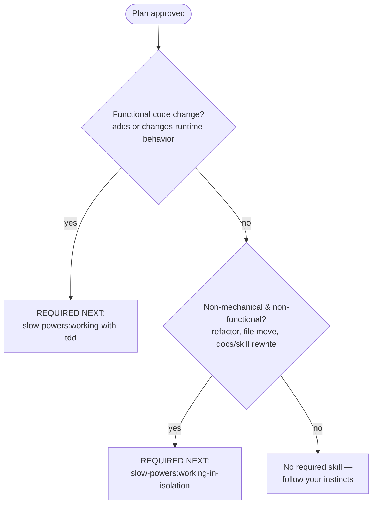

# Hardening a Drafted Plan

A drafted plan is a hypothesis, not a deliverable. This skill is the review gate between *having written* a plan and *handing it off* — to the user for approval, or to yourself for implementation. Read your own draft as if someone else wrote it, and fix what they'd otherwise have to catch.

Trust your plan mode to produce the plan and to scope its tasks at the right altitude. This skill does not re-plan — it makes sure you don't hand over a plan the reader has to debug.

This skill applies **once a plan draft exists**. It does not push you into planning when the user wants direct action.

---

## When to Use

* You've drafted a plan in a harness plan mode and are about to present it for review.
* You've written a task breakdown or design doc and are about to hand it off or start coding.
* You're revising an existing plan file (`implementation.md`, `implementation_plan.md`, `task.md`, or equivalent) before acting on it.

## When NOT to Use

* The user asked to "just build", "go fix", or "implement" something — trust the intent.
* You're investigating, reading code, or gathering context — there's no draft yet.
* The change is mechanical (typo, rename, single-line config tweak).

---

## The Fresh-Eyes Review

Before the plan leaves your hands, re-read the whole draft once, top to bottom, as a skeptical reviewer who will have to *execute* it. Check each item below and fix findings inline — no second pass, fix and move on. The bar: the user should never be the one to discover a problem you could have caught.

* **Spec coverage.** Every requirement in the request maps to at least one task. List any gaps and add tasks for them. A plan that silently drops a requirement is worse than one that flags it open.
* **No hallucinations.** Every file the plan references must actually exist (for files it modifies) or have a real, named home (for files it creates) — *verify, don't assume*. If a task says "update `src/auth/session.ts`", confirm that path is real before the reader finds out it isn't. This is the most important check: a plan built on a file that isn't there wastes the reader's time and burns trust.
* **Every step earns its place.** Each step must be a real, relevant part of accomplishing the plan's goal. Cut steps that are invented, vacuous, restate the obvious, or belong to some other task. If you can't say what a step contributes to the goal, it doesn't belong in the plan.
* **No placeholders.** Search the draft for "TBD", "TODO", "later", "if needed", "appropriate error handling", "handle edge cases", "etc." Each one defers a decision to coding time, where it gets made worse and under pressure. Decide it now.
* **Internal consistency.** A function `clearLayers()` in one task and `clearFullLayers()` in another is a bug, not a typo. Names, signatures, and data shapes must agree across tasks. Never back-reference ("similar to Task 3") — the reader may read tasks out of order; restate the relevant detail.
* **Structural coherence.** Each file the plan touches should have one clear responsibility, and files that change together should live together. In an existing codebase, follow established patterns — don't let the plan unilaterally restructure.

---

## Choosing the Next Step

When the plan is approved, the next move depends on what kind of work the plan
describes. Route by the **first** branch that matches — then **close your hand-off
by naming the required next skill verbatim**, with its `slow-powers:` identifier.
Telling the reader to "work on a branch" or "write the tests first" in your own
words is *not* the hand-off; the named skill is. State it even on a cold draft
where nothing pushed back — the named hand-off is part of the deliverable, not a
rebuttal you only produce when someone argued against it.

* **Functional code change** — adds or changes runtime behavior.
  > **REQUIRED NEXT SKILL:** You must complete `slow-powers:working-with-tdd` next, for the implementation phase. The plan should carry a tests section so the reader can see *what* will be verified, but *when* tests get written is implementer discipline TDD owns at execution time — not plan structure. (TDD in turn requires `slow-powers:working-in-isolation`, so isolation still happens on this path.)
* **Non-mechanical, non-functional change** — a structural code change (refactor, file move), a docs or skill change, or any other substantive update that doesn't alter runtime behavior.
  > **REQUIRED NEXT SKILL:** You must complete `slow-powers:working-in-isolation` next, before you start. TDD has no green to chase here, but the work still collides with other branches if it isn't isolated.
* **Informational or trivial/mechanical** — the plan is to research, run commands, or make a trivial/mechanical fix (merge-conflict cleanup, test fixups, typos). No required next skill; follow your instincts.

---

## Red Flags — Stop and Fix

* The plan references a file you never confirmed exists.
* A step doesn't map to the plan's goal — you can't say what it contributes.
* The plan contains "TBD", "TODO", "later", "if needed", "appropriate", or "etc."
* The same thing is named two different ways across tasks.
* You wrote "similar to Task N" instead of restating the content.
* TDD doesn't fit the work, so you're about to skip straight to coding with no skill at all — non-functional work still routes to `slow-powers:working-in-isolation`; only the informational/trivial branch frees you.
* Your plan closes with isolation or testing advice in your own words but never names the required next skill — paraphrasing the practice isn't the hand-off; name `slow-powers:working-in-isolation` (or `slow-powers:working-with-tdd`).

If you hit a Red Flag: stop and fix it before the plan leaves your hands. Approval comes from a plan that holds up to scrutiny, not from optimism.

---

## Common Rationalizations

| Excuse | Reality |
|--------|---------|
| "I'll decide the details while coding." | Decisions under coding pressure are worse. Decide now; write later. |
| "That file is probably where I said it is." | "Probably" isn't verified. Check it before the user does. |
| "The plan reads fine — I don't need to re-review it." | You wrote it, so you're blind to its gaps. Re-read it as someone who has to execute it. |
| "Repeating context across similar tasks is wasteful." | The reader may read tasks out of order. Restate the relevant detail. |
| "It's just docs / a refactor — it doesn't need isolation." | Non-mechanical changes still collide with other work. Route by the flowchart: structural and docs changes get `slow-powers:working-in-isolation`. |
| "TDD doesn't apply, so no skill applies." | TDD is only the *functional* branch. Non-functional, non-mechanical work still has a required next skill — isolation. |
| "I told them to work on a branch / isolate the work — that covers it." | Generic isolation advice in your own words isn't the hand-off. Name `slow-powers:working-in-isolation` as the required next skill — the named hand-off is the deliverable, on a cold draft as much as a contested one. |
