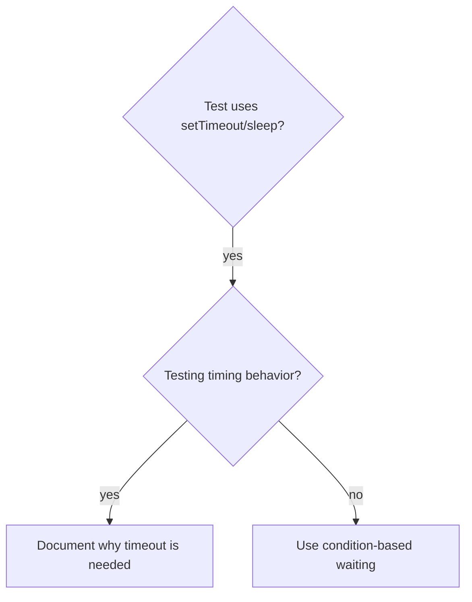

# Condition-based waiting

## Overview

Flaky tests often guess at timing with arbitrary delays. This creates race conditions where tests pass on fast machines but fail under load or in CI.

**Core principle:** Wait for the actual condition you care about, not a guess about how long it takes.

## When to use



**Use when:**
- Tests have arbitrary delays (`setTimeout`, `sleep`, `time.sleep()`)
- Tests are flaky (pass sometimes, fail under load)
- Tests timeout when run in parallel
- Waiting for async operations to complete

**Don't use when:**
- Testing actual timing behavior (debounce, throttle intervals)
- Always document WHY if using arbitrary timeout

## Core pattern

```typescript
// ❌ BEFORE: Guessing at timing
await new Promise((resolve) => setTimeout(resolve, 50));
const result = getResult();
expect(result).toBeDefined();

// ✅ AFTER: Waiting for condition
await waitFor(() => getResult() !== undefined, 'result to become available');
const result = getResult();
expect(result).toBeDefined();
```

## Quick patterns

| Scenario | Pattern |
|----------|---------|
| Wait for event | `waitFor(() => events.find((event) => event.type === 'DONE'), 'DONE event')` |
| Wait for state | `waitFor(() => machine.state === 'ready', 'ready state')` |
| Wait for count | `waitFor(() => items.length >= 5, 'at least five items')` |
| Wait for file | `waitFor(() => fs.existsSync(path), 'file to exist')` |
| Complex condition | `waitFor(() => obj.ready && obj.value > 10, 'ready object with value over 10')` |

## Implementation

The following generic polling function reports the condition it timed out waiting for:

```typescript
async function waitFor<T>(
  condition: () => T | undefined | null | false,
  description: string,
  timeoutMs = 5000,
): Promise<T> {
  const startTime = Date.now();

  while (true) {
    const result = condition();
    if (result) return result;

    if (Date.now() - startTime > timeoutMs) {
      throw new Error(`Timeout waiting for ${description} after ${timeoutMs} ms`);
    }

    await new Promise((resolve) => setTimeout(resolve, 10));
  }
}
```

See the [condition-based waiting reference implementation](./condition-based-waiting-example.ts) for domain-specific helpers (`waitForEvent`, `waitForEventCount`, `waitForEventMatch`).

## Common mistakes

- **Problem:** Polling too fast with `setTimeout(check, 1)` wastes CPU.
  **Fix:** Poll every 10 ms.

- **Problem:** Omitting a timeout can leave the loop running forever.
  **Fix:** Include a timeout with a clear error.

- **Problem:** Caching state before the loop makes the condition stale.
  **Fix:** Call the getter inside the loop.

## When an arbitrary timeout is correct

```typescript
await waitForEvent(manager, 'TOOL_STARTED');
// Wait for two 100 ms ticks after the tool starts.
await new Promise((resolve) => setTimeout(resolve, 200));
```

Use an arbitrary timeout only when all of these requirements hold:

- Wait for the triggering condition first.
- Base the delay on known timing rather than a guess.
- Explain why the delay is necessary in a comment.
