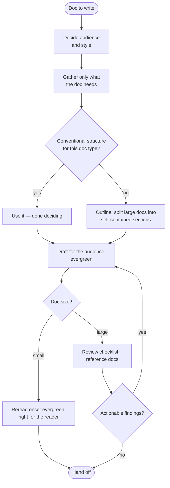

# Writing Technical Docs

## Overview

Technical writing runs through almost every development task: the README, the PR
description, the doc comment, the design doc. This skill provides a repeatable writing
process — audience, gather, structure, draft, review — whose depth **scales with the
doc**, plus reference docs to consult for specific questions.

> **The scale rule:** size every step of the process to the doc. A doc-block comment
> has a conventional structure and needs no outline; a one-line review comment needs
> no review checklist; an engineering blog post or design doc earns the full loop.
> When in doubt, do less — but the review step scales down, never to zero.

**Not for:** authoring skills (`slow-powers:writing-skills` owns the skill doc type
and takes precedence; see Related skills), or non-documentation replies (chat
answers, status updates).

## Step 0: decide the audience and style

Before writing, decide who reads this and what register fits. This decision is the
metric every later choice is checked against — structure, depth, terminology, tone.
One line of thought for a comment; an explicit audience sentence near the top of a
long doc. [doc-types.md](references/doc-types.md) lists per-type audience and
structure defaults; use them when the doc matches a type.

## The process



### Gather information

The goal is a good doc, not a thorough investigation. Collect only what the doc needs:
- Reuse what the session already established; don't re-verify confirmed facts or
  re-read code you just wrote.
- Verify the specific claims the doc will make — no more. If gathering starts to feel
  like its own research project, stop and write what you know; note genuine open
  questions in the draft instead.

### Structure the doc

- First check [doc-types.md](references/doc-types.md): if the doc matches a type, its
  conventional structure applies and this step is done. A doc-block comment has an
  exact structure; there is nothing extra to consider.
- For a large doc, write the outline and treat each section as its own small doc —
  the process applies recursively: each section makes sense alone, and together they
  make sense combined.

### Draft

This is the step where the skill has the least to say — you already write well. Two
orientations, held as *spirit*, not boxes to tick:

- **Write for the step-0 audience.** Depth, terms, and tone follow from who reads it.
  When a choice is hard, re-ask the audience question.
- **Write evergreen.** Describe the system or topic as it is, not the session that
  produced the text: no "now supports", "currently", "the new parser", "I moved this
  into `utils.ts`". Assume the output lives for months; justify exceptions (release
  notes, changelogs) rather than assuming them. The word list and exceptions live in
  [style-principles.md](references/style-principles.md#timeless-evergreen-documentation)
  — skim it once, don't memorize it.

### Review the draft

Review always happens; only its depth scales. A comment or one-paragraph doc gets a
single reread through two lenses — *is it evergreen?* and *is it right for this
reader?* A substantial doc (a page or more) earns the checklist:

```
- [ ] Audience and style: every section serves the reader decided in step 0; depth
      and terminology match what they know
- [ ] Evergreen: no time-anchored words ("now", "currently", "new", "soon"), no
      session narration, no promises of future features
- [ ] Claims: every performance, cost, or security claim is verifiable and sourced;
      no superlatives or guarantees
- [ ] Structure: follows the doc-type convention; headings nest without gaps; each
      section stands alone
- [ ] Formatting: code, commands, placeholders, lists, tables, and notices verified
      against references/formatting.md
- [ ] Links: each one necessary, descriptive, and resolving
```

Copy the checklist into your persistent task tracker when it applies. Judge each item
— a real "not applicable" is a pass, a shrug is not. Keep findings **actionable and
verifiable**: fix it or consciously drop it, but no open-ended style debates and no
back-and-forth over taste.

The reference docs are **review-time and lookup tools, not pre-draft reading**. Open
[formatting.md](references/formatting.md) when a content type appears in the doc;
open [style-principles.md](references/style-principles.md) to ground a style
decision or a review finding. Consult the online source guides only for details that
may have changed since these references were distilled.

## Failure modes — both directions

| Failure | Reality |
|---------|---------|
| "It's just a small doc — skip the process" | The process scales down to seconds, never to zero. The two-lens reread is the floor. |
| Researching "a bit more" before writing | Gathering serves the doc. When it becomes its own investigation, write what you have. |
| Reading style guides before drafting | References are for drafting lookups and review verification. Pre-draft reading is the time sink this skill exists to prevent. |
| Full checklist on a one-line comment | Over-ceremony is as much a failure as no review. Scale is the rule. |
| Checklisting — justifying each item away | A rule satisfied in letter but not spirit was not applied. Weigh justifications or make the edit. |
| Narrating the session in the doc | "I changed X", "this now works", "as of this PR" describe the edit, not the system. Describe the system. |

## Reference docs

| File | Read it when… |
|------|---------------|
| [references/style-principles.md](references/style-principles.md) | A style or tone question comes up while drafting; a review finding needs grounding; you need the evergreen word list. |
| [references/formatting.md](references/formatting.md) | A doc contains headings, lists, tables, procedures, notices, code, commands, placeholders, UI references, API comments, filenames, links, dates, or numbers — verify the formatting against it. |
| [references/doc-types.md](references/doc-types.md) | Deciding a doc's structure or audience defaults: comments, commit messages, PRs, reviews, READMEs, design docs, release notes. |

## Related skills

- `slow-powers:writing-skills` — the doc-type authority for skills: it owns skill
  structure, frontmatter, and skill-specific prose conventions (descriptions,
  rationalization-proofing, discipline framing). When writing a skill, this skill's
  style principles still govern the prose where writing-skills is silent — on any
  conflict, writing-skills takes precedence.
- `slow-powers:verifying-development-work` — owns the review pass before handing back
  code changes; its comment-hygiene checks defer to this skill's evergreen rules.
